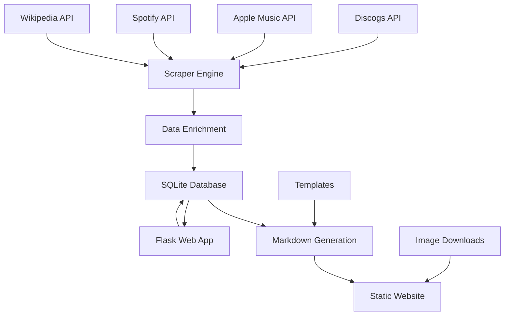

# System Architecture Overview

## High-Level System Description

The Discogs Collection Management System is a comprehensive music collection indexing and management platform that transforms a user's Discogs record collection into a rich, searchable static website with database-backed management capabilities.

## System Components

### 1. Data Collection Layer (`discogs_scraper.py`)
**Purpose**: Automated data harvesting and enrichment from multiple music APIs
**Role**: Primary data ingestion pipeline

### 2. Data Storage Layer (`db_handler.py` + SQLite)
**Purpose**: Persistent caching and data management
**Role**: Central data repository with schema management

### 3. Utility Layer (`utils.py`)
**Purpose**: Shared functionality across all components
**Role**: Common operations, formatting, and helper functions

### 4. Web Management Interface (`app.py`)
**Purpose**: Human-friendly data administration
**Role**: CRUD operations and manual data curation

### 5. Static Content Generation (Templates + Output)
**Purpose**: Hugo-compatible static website generation
**Role**: Public-facing content delivery

## Data Flow Architecture



## Component Interactions

### Primary Workflow (Collection Processing)
1. **Authentication**: Generate API tokens (Apple Music JWT, Spotify Bearer)
2. **Collection Retrieval**: Fetch user's Discogs collection with pagination
3. **Data Enrichment**: For each release:
   - Query Apple Music for high-res artwork and metadata
   - Search Spotify for streaming links
   - Fetch Wikipedia data for artist biographies
4. **Content Generation**: Create Hugo-compatible markdown files
5. **Progress Tracking**: Database-based resumable processing

### Secondary Workflow (Manual Management)
1. **Web Interface Access**: Flask app provides GUI for database
2. **Data Review**: Visual inspection of processed releases/artists
3. **Manual Editing**: JSON editor for data correction/enhancement
4. **Database Updates**: Direct manipulation of cached data
5. **Content Regeneration**: Re-trigger markdown generation as needed

## Database Schema

### Core Tables
- **`releases`**: Complete release metadata with API enrichments
- **`artists`**: Dedicated artist information and biographies
- **`skip_releases`**: User-defined exclusion list
- **`processed_index`**: Progress tracking for resumable operations

### Data Relationships
```
Collection Items (1:N) → Releases (N:M) → Artists
                              ↓
                         Cached Metadata
                              ↓
                        Generated Content
```

## External API Integration

### Discogs API (Primary Data Source)
- **Authentication**: Personal Access Token
- **Rate Limits**: 60 requests/minute (handled with 2s delays)
- **Data Retrieved**: Release details, artist info, collection items
- **Image Sources**: Album artwork, artist photos

### Apple Music API (Premium Content)
- **Authentication**: JWT tokens (ES256, 12-hour expiry)
- **Rate Limits**: Generous (1000 requests/hour)
- **Data Retrieved**: High-resolution artwork (2000x2000), editorial notes
- **Fallback**: Graceful degradation when unavailable

### Spotify Web API (Streaming Integration)
- **Authentication**: Client Credentials flow
- **Rate Limits**: Standard commercial limits
- **Data Retrieved**: Album IDs for streaming links
- **Purpose**: User engagement through streaming integration

### Wikipedia API (Biographical Content)
- **Authentication**: None required
- **Rate Limits**: Conservative usage (10 requests/second)
- **Data Retrieved**: Artist summaries, biographical information
- **Fallback**: Continues without biographical data

## File System Organization

```
discogs/
├── Core Application
│   ├── discogs_scraper.py     # Main data collection engine
│   ├── app.py                 # Web management interface
│   ├── db_handler.py          # Database operations
│   └── utils.py               # Shared utilities
├── Configuration
│   ├── secrets.json           # API credentials
│   ├── requirements.txt       # Python dependencies
│   └── templates/             # Jinja2 templates
├── Data Storage
│   ├── collection_cache.db    # SQLite database
│   ├── logs/                  # Timestamped log files
│   └── backups/               # Database backups
└── Output Generation
    └── website/
        ├── content/
        │   ├── albums/        # Release markdown files
        │   └── artist/        # Artist markdown files
        └── static/
            └── images/        # Downloaded artwork
```

## Processing Characteristics

### Performance Profile
- **CPU Usage**: Low (I/O bound operations)
- **Memory Usage**: Moderate (processes items individually)
- **Network Usage**: High (multiple API calls per item)
- **Disk Usage**: Growing (images + metadata accumulation)

### Scalability Considerations
- **Collection Size**: Handles 1000+ releases efficiently
- **API Rate Limits**: Primary bottleneck (2-10s per item)
- **Database Performance**: SQLite suitable for single-user workloads
- **Parallel Processing**: Limited by external API constraints

## Error Handling Strategy

### Resilience Mechanisms
1. **Graceful Degradation**: Continues with partial data when APIs fail
2. **Progress Persistence**: Database-tracked resumable operations
3. **Comprehensive Logging**: Detailed error context for debugging
4. **Fallback Chains**: Multiple sources for each data type
5. **Manual Override**: Web interface for error correction

### Recovery Patterns
- **API Failures**: Continue with cached/partial data
- **Rate Limiting**: Automatic retry with backoff
- **Network Issues**: Skip problematic items, log for later retry
- **Data Corruption**: Web interface allows manual correction

## Security Architecture

### Current Implementation
- **API Key Management**: File-based secrets storage
- **Database Access**: Local SQLite file
- **Web Interface**: Development-grade security
- **Image Downloads**: Basic HTTP with headers

### Security Boundaries
- **Local Operation**: No external access to user data
- **Read-Only APIs**: No data modification on external services
- **Personal Use**: Single-user assumption throughout system
- **Development Focus**: Security considerations minimal

## Integration Points

### Static Site Generator (Hugo)
- **Input Format**: Markdown with YAML frontmatter
- **Image Handling**: Local file references
- **Content Structure**: Hierarchical organization
- **Build Process**: External to this system

### External Tools
- **Version Control**: Git integration for content tracking
- **Deployment**: CI/CD pipeline for website updates
- **Monitoring**: Log file analysis for operational insights
- **Backup**: Database export for data preservation

## Operational Workflows

### Initial Setup
1. Install Python dependencies (`pip install -r requirements.txt`)
2. Configure API credentials (`secrets.json`)
3. Obtain Apple Music private key (`.p8` file)
4. Run initial collection processing (`python discogs_scraper.py --all`)

### Regular Operations
1. **Incremental Updates**: Process new collection items
2. **Content Regeneration**: Update existing pages with new data
3. **Manual Curation**: Use web interface for data quality
4. **Website Deployment**: Hugo build and publish

### Maintenance Tasks
1. **Database Backups**: Automatic on web app startup
2. **Log Rotation**: Manual cleanup of timestamped logs
3. **API Token Refresh**: Apple Music tokens auto-regenerate
4. **Cache Management**: Manual database cleanup if needed

## Refactoring Opportunities

### Current Architecture Limitations

#### Monolithic Design
- **Single Large Files**: Core functionality concentrated
- **Mixed Concerns**: API, processing, and generation combined
- **Tight Coupling**: Components heavily interdependent

#### Configuration Management
- **Hardcoded Constants**: Settings scattered throughout code
- **Environment Handling**: No environment-specific configurations
- **Secret Management**: Basic file-based approach

#### Error Recovery
- **Basic Retry Logic**: Simple backoff strategies
- **Limited Logging**: Could be more structured
- **Manual Intervention**: Required for many error conditions

### Proposed Architecture Improvements

#### Service-Oriented Design
```
Core Services
├── DiscogsService      # Discogs API client
├── AppleMusicService   # Apple Music API client
├── SpotifyService      # Spotify API client
├── WikipediaService    # Wikipedia API client
└── ContentService      # Markdown generation

Supporting Services
├── ConfigService       # Centralized configuration
├── CacheService        # Database operations
├── LoggingService      # Structured logging
└── ProgressService     # Operation tracking
```

#### Enhanced Error Handling
- **Circuit Breaker Pattern**: Prevent cascade failures
- **Retry Strategies**: Exponential backoff with jitter
- **Dead Letter Queue**: Failed operations for later retry
- **Health Checks**: Service availability monitoring

#### Configuration Architecture
- **Environment-Based**: Development/production configurations
- **Secret Management**: External secret stores
- **Feature Flags**: Toggle functionality dynamically
- **Validation**: Schema-based configuration validation

#### Performance Optimization
- **Async Processing**: Parallel API calls where possible
- **Connection Pooling**: Reuse HTTP connections
- **Caching Layers**: Redis for frequently accessed data
- **Batch Operations**: Group similar operations

#### Observability Improvements
- **Structured Logging**: JSON-formatted log entries
- **Metrics Collection**: Prometheus-compatible metrics
- **Distributed Tracing**: Request flow across services
- **Health Dashboards**: Operational status monitoring

### Migration Strategy

#### Phase 1: Foundation
1. **Extract Services**: Create dedicated API client classes
2. **Configuration Layer**: Centralized settings management
3. **Enhanced Logging**: Structured logging implementation
4. **Unit Testing**: Comprehensive test coverage

#### Phase 2: Architecture
1. **Dependency Injection**: Loose coupling between components
2. **Interface Abstraction**: Define service contracts
3. **Error Handling**: Implement resilience patterns
4. **Performance**: Add caching and optimization

#### Phase 3: Enhancement
1. **Async Operations**: Parallel processing capabilities
2. **Monitoring**: Observability and metrics
3. **Security**: Authentication and authorization
4. **Scalability**: Multi-user and high-volume support

This refactoring approach maintains backward compatibility while enabling significant architectural improvements for future scalability and maintainability. 